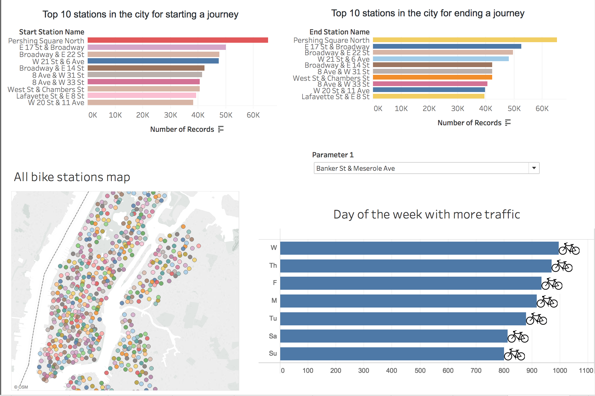

# Citibike_Tableau

This assignment is to aggregate the data found in the Citi Bike Trip History Logs to build a data dashboard, story, or report. I merged multiple datasets from Aug 2018 to Dec 2018 using Pandas, created couple of dashboards and worksheets to display the results. The complete work can be found at the following link : https://public.tableau.com/profile/m7848#!/vizhome/citibike_17/Dashboard1?publish=yes

ScreenShots of the Dashboard

